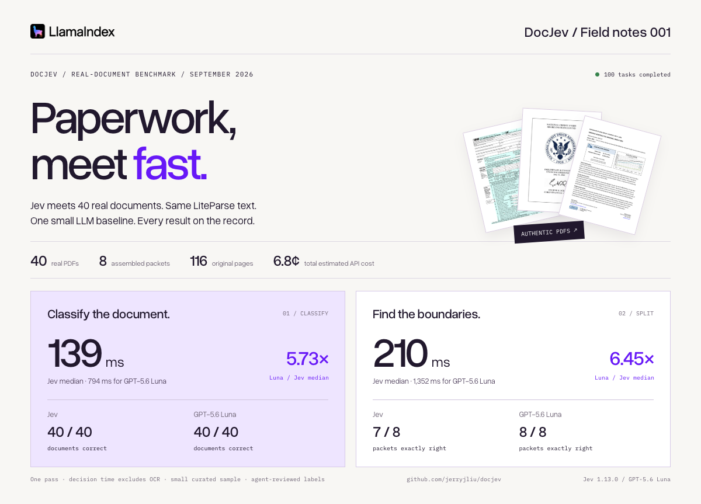

# Paperwork, meet fast.

A visual field report from DocJev’s **40-document / eight-packet** accuracy run, in LlamaIndex’s brand style.



**[Download the interactive report](index.html?raw=1)** and open the downloaded HTML in your browser. It is a single self-contained file: fonts, original-page previews, and recorded results are embedded. It works offline and makes no API calls. GitHub displays HTML as source, so download it to use the interactive views.

- Explore every classification, filter by category, and inspect timings and review flags.
- Compare the original boundaries with both engines’ segments across all eight packets.
- Replay the recorded median timings at real speed; this is an illustration, not a live model run.
- Enlarge the authentic FOMC pages to see Jev’s one extra split.

The [summary PNG](summary.png) is ready for a README, post, or presentation. The full report also adapts to mobile screens and supports browser printing.

The same LiteParse text was shared between engines. These are single-pass results on a curated sample of English public-sector PDFs; the eight packets reuse the 40 originals. Labels received separate agent review, with no human annotation review. Decision times exclude OCR. Costs are estimates from recorded usage, with local compute excluded.

[Full numerical report](../../benchmarks/results/real-small-v1-run01/report.md) · [Error analysis](../../benchmarks/results/real-small-v1-run01/error-analysis.md) · [Raw results](../../benchmarks/results/real-small-v1-run01/raw.jsonl) · [Dataset](../../datasets/real-small/README.md) · [Rights and attribution](../../datasets/real-small/v1/NOTICE.md)

## Rebuild offline

From the repository root:

```sh
uv run python scripts/build_visual_report.py
```

This validates source PDF hashes and reconciles accuracy, medians, costs, and paired OCR hashes against the saved observations before generating `data.json`, authentic previews, and `index.html` from `template.html`. It does not read credentials, private OCR text, or call either model. Embedded fonts include their license text; copies and asset provenance are in [assets](assets/NOTICE.md).

To regenerate the PNG, install the optional browser renderer once:

```sh
uv run --with playwright playwright install chromium
uv run --with playwright python scripts/capture_visual_report.py
```

The capture uses the report’s `?share=1` layout at 1200 pixels wide. `REPORT_CHROMIUM_PATH` can point to an already installed Chromium executable. The HTML and PNG do not require Playwright to view.
