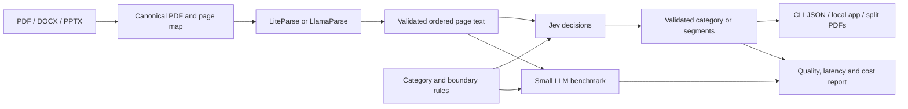

# DocJev Classification and Splitting Implementation Plan

Created: September 18, 2026. Execution update: September 19, 2026. Status: implementation, local release checks, both videos, and the clean source-release archive are complete. The full synthetic evaluation and remote CI matrix have not been run. Nothing has been published externally.

## Overview

Build **DocJev**, a small open-source Python package (`docjev` distribution and CLI; `jev_docs` in Python), that reads documents with LiteParse or LlamaParse and uses Jev for document classification and page segmentation. Ship a CLI, a lightweight local visual app using the same library, reproducible benchmarks, redistributable samples, and two actual screen-recorded demos.

The release story is straightforward: **turn a mixed document inbox into categories, and a combined packet into individual documents—with measured decision speed.** The package is open source; Jev is a hosted service. Local LiteParse OCR does not make the complete pipeline offline.

## Execution record — September 19, 2026

- Implemented the Python library, CLI, LiteParse OCR, three optional LlamaParse tiers, canonical-PDF conversion/export, Jev and Luna adapters, local branded app, and reproducible evaluation harness.
- **User-directed scope change:** the default app and public videos now use authentic public IRS, Treasury, BEA, and SEC publications. The 15-page packet preserves the original pages and includes adjacent distinct Treasury result sheets. Synthetic examples and the 60-document / 24-packet corpus remain separate fixtures. See [real-source provenance](../examples/real/README.md).
- **Measured pilot:** one ten-page BEA release plus one 15-page assembled packet; one excluded warmup and three timed repetitions per engine/task; 16 total successful calls. Both engines matched the declared labels/assembly on every run. Jev/Luna median decision times: 182.5/785.4 ms classification, 293.8/1,590.8 ms splitting. Estimated total API cost including warmups: $0.016941402. This is a demonstration, not a held-out accuracy study. Luna benefited from near-complete input caching during timed calls. [Recorded report](../benchmarks/results/real-doc-pilot-20260919/report.md).
- **Verified locally:** 77 offline tests passed (three paid OCR tests deselected); Ruff, mypy, and wheel/sdist builds passed. A fresh Python 3.12 wheel environment outside the checkout parsed the real ten-page PDF with optional cloud/web packages absent; adding the demo extra served the real collection, HTML, fonts, and logo. No new paid calls were used for release verification.
- All three Parse tiers passed separate one-page live smoke checks. The API does not expose a resolved date for `latest` in these responses; no fully pinned cross-tier reproducibility claim is made. [Compatibility notes](../docs/compatibility.md).
- Package inspection found and fixed inclusion of local dataset QA caches in the source distribution. Rebuilt wheel and sdist contain no current-user absolute paths or runtime credentials. The final externally shared source archive is a separate root task.
- **Still unperformed:** the 660-measured-call full synthetic evaluation, concurrency-four throughput condition, full end-to-end OCR comparison, extended OCR-tier dataset study, process-cold study, matched-decision baseline, actual remote GitHub CI, and Python 3.11/Linux execution. These are not reported as completed.
- **Videos complete:** classification 76.4 seconds and splitting 96.8 seconds, both captioned silent H.264 at 1920×1080/30 fps. Full-file decoding, full-resolution frames, and ordered motion sequences passed review; actual processing is retained at normal speed. The splitting ending shows a downloaded PDF from the same successful run. [Media and recorded-run evidence](../docs/media/README.md).
- **Release archive complete (before the DocJev rename):** `output/release/jev-docs-0.1.0.zip` contains the source, examples, evaluation fixtures and pilot, both videos, captions, and actual split PDFs. Its manifest records every included file's hash. Runtime credentials, personal paths, local caches, environments, and raw recordings are excluded; archive integrity and credential/path scans passed. [Publishing notes](../docs/publishing.md).

The original design below remains as historical implementation guidance; checkboxes represent verified execution, not every proposed stretch experiment.

## Initial State Analysis (historical research snapshot)

### Key Discoveries

- [`research/2026-09-18-workspace-inventory.txt:3`](../research/2026-09-18-workspace-inventory.txt) — empty workspace, no existing code, tests, or Git history.
- [`research/2026-09-18-workspace-inventory.txt:7`](../research/2026-09-18-workspace-inventory.txt) — Python tooling and video utilities exist, but installed parser packages do not match current documentation.
- [`research/2026-09-18-workspace-inventory.txt:21`](../research/2026-09-18-workspace-inventory.txt) — Jev key absent from the current process; LlamaCloud/OpenAI variable presence is not authentication verification.
- [Research report](../research/2026-09-18-jev-document-classification-splitting.md) — current LiteParse Python bindings, Parse v2 tiers, page conventions, model interfaces, prices, and evidence links.
- [Jev API](https://docs.typesafe.ai/api) — typed category and boundary questions can share page text; question IDs are invisible to the model.
- [Jev confidence semantics](https://docs.typesafe.ai/confidence) — provider confidence differs from the selected category's probability.
- [Public Split shape](https://developers.llamaindex.ai/llamaparse/split/getting_started/) — category plus 1-based pages is a useful external contract; no internal Split implementation was consulted.

The dependency version candidates observed during research are `typesafe-sdk==0.7.0`, `liteparse==2.14.6`, and `llama-cloud==2.16.0`. Verify and lock compatible releases during Phase 0. Public documentation and package versions can change between planning and execution.

## Desired End State

A new user can clone the repository, install it, supply a Jev key, and run:

```sh
uv sync --extra dev
uv run docjev doctor
uv run docjev classify examples/classify/inbox --rules examples/classify/rules.yaml
uv run docjev split examples/split/claim-packet.pdf --rules examples/split/rules.yaml --export-dir output/segments
uv run docjev classify sample.docx --rules rules.yaml --ocr llamaparse --tier agentic-plus
uv run docjev demo
```

These are proposed command contracts, not commands that work yet. The README will document the relevant optional extras for LlamaParse, the app, and benchmarks; the minimal installation will not require them.

The release includes:

1. PDF, DOCX, and PPTX inputs; local OCR enabled by default; optional cost-effective, agentic, and agentic-plus Parse tiers.
2. Python and CLI interfaces returning validated JSON with categories, pages, parser/model provenance, timings, and available usage.
3. True contiguous document-instance segmentation, including adjacent documents with the same category.
4. Separate classification and splitting examples and datasets.
5. A fair measured comparison against a small LLM, with full raw results and no predetermined speedup claim.
6. A branded local app, two captioned 1080p MP4s, screenshots, and a publication-ready README.

## What We're NOT Doing

- Inspecting, calling, wrapping, or reimplementing private LlamaIndex Classify/Split internals. Only their public I/O documentation informs the new contract.
- Training or fine-tuning Jev, self-hosting its model, or claiming that typed output guarantees correct decisions.
- Building a hosted SaaS product, accounts, billing, a database, or a production queue.
- Arbitrary intra-page cuts, geometric crop segmentation, noncontiguous document reconstruction, native DOCX/PPTX fragment editing, or exhaustive support for every file format.
- Silent truncation, skipping failed OCR pages, invented confidence, or fabricated benchmark numbers.
- A large multi-model leaderboard or broad production-accuracy claims from synthetic examples.
- Publishing a GitHub repository, PyPI package, website, or social post during the planning pass. The final implementation deliverable is ready for the user to publish; no external publication is assumed.

## Implementation Approach

### Decisions and tradeoffs

| Decision | Recommended approach | Reason / alternative |
|---|---|---|
| Package | Python library + Typer CLI, Python 3.11+ | Matches the user's preference and current native Python OCR support. No need for a Node wrapper. |
| Visual demo | FastAPI serving a small HTML/CSS/JavaScript app, packaged static files | Full brand control and useful page previews without a separate frontend build. Streamlit is faster to scaffold but constrains the visual presentation. CLI-only remains an easy scope reduction. |
| OCR | LiteParse default; Parse v2 optional extra | Local/free OCR path plus explicit quality/cost alternatives. |
| Office pagination | Convert to one retained canonical PDF before either parser | Both providers, the preview, and segment exports reference identical pages. |
| Decisions | Direct TypeSafe SDK adapter | Retains native probabilities and predictable instrumentation. |
| Baseline | Direct OpenAI adapter; configurable `gpt-5.6-luna`, reasoning `none` | A current small model, with terse structured output and explicit settings. Record the returned model; do not invent a dated snapshot. |
| Data | Small first-party synthetic corpus | Reproducible labels, editable source documents, clear redistribution terms. Optional public validation later. |
| License | Apache-2.0 code; CC0 first-party synthetic data | Proposed defaults. Fonts, third-party dependencies, and trademarks retain their own notices. |

The user was asked about Jev access and app scope during research. Until answered, the plan assumes the CLI plus local app; live Jev validation remains contingent on actual access. These choices do not block local scaffolding or offline tests. Never substitute mocked results for a successful Jev integration.

### Data flow



All model calls consume page text only. File names, ground truth, packet assembly maps, and demo labels do not enter prompts. Document text is delimited as untrusted source content. Both adapters handle invalid responses and failures explicitly.

### Public schemas

Use Pydantic models with `schema_version: "1"` and one consistent category identifier convention. YAML is convenience input; the Python/JSON shape is the source of truth.

| Model | Fields and semantics |
|---|---|
| `CategoryRule` | Unique `id`, natural-language `description`. Reserve `other` as fallback; validate labels and total option count. |
| `RuleSet` | `categories`, optional classification instructions, optional `splitting_instructions`; no provider-specific SDK names. |
| `ParsedDocument` | Source hash, input format, canonical PDF hash/path, page count, ordered `pages`, parser/tier/version/options, conversion metadata, cache status, timing/usage. |
| `Page` | 1-based `number`, `text`, optional Markdown, parse status; preserve blank pages. |
| `ClassificationResult` | `category`, optional `category_probability`, optional `probabilities`, optional `provider_confidence`, `needs_review`, warnings, provenance, metrics. |
| `PageDecision` | Page category and available native scores; `starts_document_probability` for Jev, discrete boundary for a decision-only baseline. |
| `Segment` | Stable segment ID, `category`, ordered contiguous `pages`, inclusive start/end, review flags, optional labeled score summary. |
| `SplitResult` | Ordered `segments`, page decisions, boundary decisions, warnings, provenance, metrics. |
| `RunMetrics` | Conversion/OCR/decision/validation/export/total timings; attempts, request IDs, requested/resolved models, raw usage, measured/estimated/unknown API costs. |

Example result shape:

```json
{
  "schema_version": "1",
  "segments": [
    {"id": "segment-001", "category": "invoice", "pages": [1, 2]},
    {"id": "segment-002", "category": "invoice", "pages": [3, 4]},
    {"id": "segment-003", "category": "other", "pages": [5]}
  ]
}
```

The same category can occur in multiple segments. Categories are decisions; low confidence is a separate review signal. An unreadable document produces a parse/empty-content error or explicit review outcome, never a confident fallback prediction.

### Page and error contract

- PDF pages use original 1-based ordinals. DOCX pages use the retained rendered PDF; PPTX uses one slide per rendered PDF page, verified in conversion fixtures. Record converter version, fonts/profile, and hashes.
- The first release supports PDF/DOCX/PPTX. Image-only PDFs exercise OCR without adding ambiguous multi-image input semantics.
- Explicitly preserve blank pages. Determine blankness from successful parsing plus a conservative rendered-page blankness check, not empty OCR text alone. Visible content with missing text is unreadable/needs-review; ambiguous blankness is not treated as verified blank. A verified blank page receives `other` and participates in coverage; consecutive blank fallback pages may share a segment. Use the same published policy in labels and both engines. Do not discard them after evaluation.
- Reject unreadable/encrypted inputs with actionable errors. A partially failed OCR document cannot enter inference as if it were complete. `doctor` checks Office conversion and local OCR readiness.
- Every successful split covers pages `1..N` exactly once, with ordered contiguous, nonempty segments. Exports always use the canonical PDF, including Office inputs.
- Overwrite requires an explicit CLI flag; directory classification writes deterministic JSONL with one success/error record per input. JSON goes to stdout; progress goes to stderr.

### Classification algorithm

1. Parse every source page; validate completeness and usable text.
2. Build shared state with page numbers and content. Supply all category descriptions and an explicit fallback. Ask one `Choice` for the predominant document purpose, using all pages.
3. Retain the complete distribution and provider confidence separately. Optional review thresholds operate on named scores and are frozen on development data; they are not called calibrated without evidence.
4. For v0.1, reject whole documents exceeding the supported input budget with a clear size/context message. Do not classify only the first few pages or average independent page labels and call it whole-document classification. Hierarchical classification is deferred.

The Jev documentation specifies two distinct limits: 32k tokens for state plus the longest individual question, and 64k tokens for state plus all questions combined. There is no official local tokenizer. Check both budgets using conservative serialized-byte/character estimates with measured margins and explicit provider-limit handling. Document that the estimate is approximate; log estimated size and actual reported tokens. A budget rejection is visible and is counted in benchmark completion rates.

### Splitting algorithm

1. Define a boundary as a new source-document instance, including a new invoice immediately following another invoice. User rules can clarify domain-specific boundaries.
2. For a bounded packet, send all page text with one category `Choice` per nonblank page and one `Noul` boundary question before each noninitial, nonblank page. Each question names its target and context pages in its instructions. Page 1 starts deterministically; blank-page handling follows the fixed policy above.
3. For larger packets, use contiguous windows with one preceding and one following context page. Each output page and preceding boundary has exactly one owning window. Start with a configurable target of eight output pages; expand to one call for smaller packets, and shrink when state/question budgets require it. Never drop page content.
4. Category changes always create a boundary. A positive boundary decision also splits equal-category neighbors. Label/boundary disagreement is flagged for review, with the documented deterministic result retained. No hidden smoothing on test examples.
5. Start with a configurable Noul threshold of 0.5; any tuned threshold must be selected on the development set before the held-out evaluation. Preserve raw probabilities.
6. On a provider size rejection, recursively shrink windows without losing ownership. Record all attempts, delays, and available costs. If a required page/context pair cannot fit, return a clear error; no text truncation. A local estimate is not a guarantee of acceptance.
7. Assemble segments, enforce invariants, then optionally export each segment as a PDF with a manifest. Category-score summaries are labeled aggregations, not joint segment probabilities.

Bounded concurrency is configurable. Default interactive behavior minimizes requests; the benchmark separately fixes and discloses concurrency. Nested SDK/application retries are avoided.

## Phase 0: Validate external interfaces and establish the repository

### Overview

Make the setup reproducible and resolve SDK/page-shape assumptions before implementing business logic.

### Changes Required

- **Files:** `pyproject.toml`, `uv.lock`, `.python-version`, `.gitignore`, `.env.example`, `src/jev_docs/__init__.py`, `src/jev_docs/doctor.py`, `docs/compatibility.md`.
- Initialize a local Git repository. Choose Python 3.12 for the lockfile and test Python 3.11/3.12. Pin reproducibility in the lockfile; set appropriate compatible runtime bounds in package metadata.
- Declare minimal dependencies: LiteParse, TypeSafe SDK, Pydantic, Typer, and safe YAML loading. Optional groups: `llamaparse`, `baseline`, `demo`, `datasets`, `dev`.
- Verify native wheel installation, a tiny scanned PDF, language-data setup, LibreOffice conversion, screenshot generation, and retained blank pages in a fresh environment.
- Verify the current TypeSafe request/response against a tiny real request when credentials are available. Pin `jev-1.13.0` if still accessible and record the resolved model. Verify each requested Parse tier and a supported pinned parser version with tiny fixtures.
- Confirm the baseline account can call the chosen small model with explicit reasoning disabled and strict structured output. Do not switch to a larger model silently.
- Record actual SDK response fields, nullable usage behavior, retry configuration, installed versions, and any documented limits that differ from research.

### Success Criteria

**Automated verification**

- [x] `uv sync --all-extras` succeeds in isolation; no changes to the global Python environment.
- [x] `uv run docjev doctor` reports dependency readiness and credential presence without revealing secrets.
- [x] Native-text, scanned, blank-page, DOCX, and PPTX smoke fixtures yield expected page counts and numbering.
- [x] Live contract checks are separately marked and report pass, fail, or skipped with the reason. Missing access never counts as passed.

**Manual verification**

- [x] Inspect the rendered Office pages and OCR fixture text.
- [x] Confirm a real Jev result and a Parse result match the captured adapter contract; resolve discrepancies before relying on them.

**Implementation note:** Complete the listed manual checks before advancing the dependent integration work. The implementer can perform these checks; routine checks do not require another user approval. An actual missing credential blocks only that live integration, not independent local work.

## Phase 1: Build the document and OCR layer

### Overview

Create the shared page representation that both tasks and both inference engines use.

### Changes Required

- **Files:** `src/jev_docs/schemas.py`, `documents.py`, `conversion.py`, `cache.py`, `ocr/base.py`, `ocr/liteparse.py`, `ocr/llamaparse.py`, `tests/test_documents.py`, `tests/test_ocr_contract.py`.
- Normalize source files into retained canonical PDFs and explicit page maps. Use a temporary LibreOffice profile per conversion, safe subprocess arguments, bounded timeouts, and a documented font set.
- Use current LiteParse Python bindings directly. Preserve page ordinals and error information; normalize to a fixed text rendering for inference.
- Map CLI tiers `cost-effective`, `agentic`, `agentic-plus` to Parse v2 values. Upload with `purpose="parse"` only, retrieve page Markdown plus usage, and validate source-page coverage.
- Persist a content-addressed OCR cache keyed by canonical bytes, converter options/version, parser/tier/version, language, output normalization, and schema version. Cache hits are visible in results.
- Keep timing spans separate and avoid placing raw document text or keys in incidental console logs. Cached documents are local artifacts excluded from Git by default.

### Success Criteria

**Automated verification**

- [x] `uv run pytest tests/test_documents.py tests/test_ocr_contract.py` covers incomplete/reordered pages, blank pages, cache invalidation, conversion failures, and provider errors.
- [x] A multi-page scan reaches usable text through LiteParse; PDF/DOCX/PPTX preserve the canonical page contract.
- [x] Live tests validate all three optional Parse tiers on tiny fixtures without invoking Classify/Split.

**Manual verification**

- [x] Compare source previews and text for representative native, scanned, and Office inputs.
- [x] Confirm cache status, page identity, and tier choice are readable in results.

## Phase 2: Implement classification, splitting, and the CLI

### Overview

Deliver the usable library and command line before adding a visual layer.

### Changes Required

- **Files:** `src/jev_docs/rules.py`, `engines/base.py`, `engines/jev.py`, `classify.py`, `split.py`, `windows.py`, `export.py`, `telemetry.py`, `cli.py`, `tests/test_classify.py`, `tests/test_split.py`, `tests/test_cli.py`.
- Expose synchronous convenience functions and async core operations accepting file paths or an existing `ParsedDocument`. Both return the public models.
- Implement the documented algorithms, explicit unknown/review outcomes, context handling, one-owner windowing, measured retry policy, and PDF exports.
- Reserve no more than 254 user categories plus `other` under the published 255-choice ceiling; practical smaller rule sets may reach input budgets sooner.
- Define `classify`, `split`, `parse`, and `doctor` commands with machine-readable results, predictable exit behavior, output paths, parser settings, and explanatory errors. `classify` supports a file or directory; `split` accepts one source file.
- Record request attempts defensively: the TypeSafe request-ID accessor can fail when its header is absent. Missing cost/usage remains null with an explicit status.
- Include a clear README statement that OCR text is sent to the selected hosted decision engine.

### Success Criteria

**Automated verification**

- [ ] `uv run pytest tests/test_classify.py tests/test_split.py tests/test_cli.py` passes meaningful fixtures: two adjacent invoices, unlabeled continuation pages, category/boundary conflict, blanks, unknowns, oversize content, and a boundary at a window edge.
- [ ] Property-based tests verify no gaps/overlaps, ordering, stable IDs, and page preservation across many window sizes. **Partial:** page ownership/order/context across randomized window sizes is tested; stable-ID and all aggregation combinations are not exhaustively property-tested.
- [ ] CLI output validates against the public schema; export page counts match segment membership.
- [x] Live Jev smoke tests for both tasks pass with authentic saved telemetry.

**Manual verification**

- [ ] Run both tasks from a clean terminal using only README instructions.
- [ ] Inspect each exported document from a packet with repeated adjacent categories.
- [ ] Confirm document-internal instructions do not become application actions; include adversarial text as an evaluated failure case, not an assumed solved problem.

## Phase 3: Produce examples and a frozen small dataset

### Overview

Create visually useful examples and an independently labeled evaluation corpus before tuning against results.

### Changes Required

- **Files:** `examples/classify/`, `examples/split/`, `datasets/generate.py`, `datasets/manifests/`, `datasets/DATASET_CARD.md`, `datasets/LICENSE`, `tests/test_dataset_integrity.py`.
- Create clearly labeled synthetic businesses and people. No real personal records or external customer documents.
- **Classification corpus:** 60 independent source documents, 10 for each category: invoice, purchase order, contract, résumé, pitch deck, and other. Hold out 48 for testing; use 12 for development. Mix layouts, formats, lengths, native text, and scans without making format a label shortcut.
- **Splitting corpus:** 24 packets, six development and 18 test, approximately 6–18 pages each. Categories: claim form, incident report, repair estimate, invoice, correspondence, and other. Include adjacent same-type source documents, title-free continuations, repeated headers, blanks, and poor scans.
- Partition by source identity and layout/template family. All variants and packet constituents belonging to a source stay in the same split. Test layouts must differ from development layouts. Held-out packets must use disjoint constituent source documents so packet-level uncertainty estimates do not treat reused sources as independent observations; group any optional related variants explicitly.
- Derive labels from generation/assembly manifests, then visually review them. Neither Jev nor the baseline creates the authoritative labels.
- Use neutral inference filenames/metadata; keep category hints and generation labels in separate manifests only.
- Keep the six classification demo documents and the curated splitting demo packet separate from the held-out test set. Store seeds, source IDs, canonical hashes, format, scan conditions, template family, expected labels, segment ranges, and licenses.
- Add a small format-parity fixture set using equivalent PDF, DOCX, and PPTX content; report variants as related observations rather than independent documents.

### Success Criteria

**Automated verification**

- [x] `uv run python datasets/generate.py --verify` reproduces source content/manifests and validates stable content or declared rendering hashes. Rechecked September 19; real-source assembly verification also passed for all five originals and 15 packet pages.
- [x] `uv run pytest tests/test_dataset_integrity.py` checks split isolation, labels, page coverage, adjacent same-type cases, and no benchmark/demo overlap.
- [x] Freeze manifests and hashes before evaluating test accuracy; later changes create a new dataset version.

**Manual verification**

- [ ] Inspect every ground-truth boundary and classification source at a readable scale; spot-check all rendered pages and inspect any flagged rendering issues.
- [ ] Verify documents look plausible and the intended category can be determined from document content.
- [x] Check first-party data licensing and preserve font notices.

The corpus is a controlled small benchmark. If scope must be reduced, the two demo sets and honest speed measurements remain required; this extended quality corpus is the user's optional stretch work. The architecture supports it without making a larger public dataset a prerequisite.

## Phase 4: Measure accuracy, latency, and cost fairly

### Overview

Generate evidence for any external speed claim, and present task quality alongside speed.

### Changes Required

- **Files:** `src/jev_docs/engines/openai.py`, `benchmarks/run.py`, `metrics.py`, `report.py`, `configs/default.yaml`, `pricing.json`, `results/`, `tests/test_metrics.py`, `docs/benchmark-methodology.md`.
- Default small baseline: `gpt-5.6-luna`, explicitly `reasoning.effort="none"`, strict output, no explanations, and bounded output size sufficient for the packet. Save requested/returned model and SDK/settings; verify availability first.
- **Primary practical comparison:** use efficient task-level implementations. The LLM may classify a document or return all packet segments in one call when context permits. Do not force page-by-page LLM network calls. Both engines receive the same OCR content and semantic rules, and produce the same user-facing category/segment contract.
- **Secondary matched-decision comparison:** same page windows, category/boundary decisions, aggregation, and concurrency. Label it separately; it explains engine effects without replacing the practical task result.
- Native Jev distributions are optional evidence. Do not ask the primary LLM baseline to emit probabilities/rationales merely to match fields, and do not invent one-hot confidence for it.

### Measurement protocol

1. Freeze dataset, prompts, thresholds, window settings, timeout/retry policy, model configuration, dependency lock, and price date before held-out testing.
2. Parse each benchmark document once per OCR condition; store the normalized artifact. For decision-only runs, both engines consume that exact artifact. Disable application result caches.
3. Use three excluded warmups per engine/task on development-only items, then five measured passes of held-out documents. Interleave/randomize provider order with a seed. Evaluate accuracy per unique source on the first predeclared pass; report repeat disagreement separately. Repeats increase latency samples, not independent accuracy sample size.
4. Report sequential concurrency 1 as primary; run a separate modest concurrency-4 throughput experiment within verified rate limits. Measure full packet completion, including every window and aggregation, as the splitting headline.
5. Measure process-cold and warm-client conditions separately. Document preloaded OCR language data. Do not imply control over the provider's server cache/cold state.
6. Run real full-pipeline measurements on a fixed subset from raw files with OCR cache disabled. Record conversion, OCR, decisions, validation, and optional export. A sum projected from cached OCR is labeled an estimate, not a measured end-to-end run.
7. Run the three LlamaParse OCR tiers on a fixed difficult subset (target 12 classification documents and six packets), using the same canonical PDFs. Report this OCR comparison separately from the primary LiteParse+Jev versus LiteParse+LLM comparison. Start with fewer documents if the budget estimate requires it.
8. Save all errors, timeouts, refusals, retries, tokens, cache counters, request IDs, timestamps, machine/OS, region, parser versions, and raw observations. Distinguish successful latency distributions from completion rate and overall deadline failure. Headline classification accuracy and whole-packet exact match use every planned first-pass test item as the denominator: timeout, refusal, size rejection, invalid output, and OCR failure count as unsuccessful. Failed jobs contribute missing predictions to page/segment recall. Quality conditioned on completed jobs is secondary and explicitly labeled.

### Reported metrics

| Area | Metrics |
|---|---|
| Classification | Top-1 accuracy, macro-F1, per-class precision/recall, confusion matrix, review/abstention coverage, completed-task rate |
| Splitting | Page-label accuracy/macro-F1; exact boundary precision/recall/F1 excluding page 1; exact category+range segment F1; whole-packet exact match; same-category boundary recall; coverage validity |
| Latency | Per-document/packet p50 and p95 decision time; real end-to-end time; conversion/OCR stages; process-cold/warm; sample counts and uncertainty intervals |
| Throughput | Documents/second and pages/second at stated concurrency, with failure rate |
| API cost | OCR and decision costs separately; total API cost/document and per 1,000 pages; cost per completed correct task where defined; total run spend including attempts |
| Reliability | Invalid output, missing pages, context rejection, refusal, timeout, retry counts, ambiguous/unknown results |

Bootstrap uncertainty by source document/packet; do not treat the five repetitions as five independent accuracy samples. Define zero-boundary and no-predicted-boundary cases in metric tests. With a small corpus, make percentile and generalization limits explicit.

Version the price table. Initial reference rates come from the research report. Capture actual usage where available; otherwise mark estimates or unknown values. OpenAI cost calculation distinguishes ordinary input, cached input, cache writes, and output; Jev has nullable usage; LlamaParse credits may settle later. LiteParse has zero OCR API fee, not zero compute cost. Partial retry cost must not be reported as a complete total.

Default execution budget: a configurable **$10 estimated API-spend guard for the initial evaluation**, with a dry-run page/token estimate and conservative reservations for in-flight calls and retries. It is not a guaranteed provider billing cap: usage can be nullable and token estimates are approximate. Use provider hard caps if available. Stop dispatching paid work when the remaining spend cannot be bounded conservatively; retain unknown charges explicitly. The first pilot determines whether the full OCR subset fits; reduce only the predeclared optional OCR subset before running it, recording the change. Timing repetitions use cached OCR to avoid repeated Parse charges. This is a bounded execution default, not a paid action in the planning pass.

### Success Criteria

**Automated verification**

- [x] `uv run pytest tests/test_metrics.py` verifies metrics against small hand-computed cases, including adjacent same-category boundaries and failed jobs.
- [x] `uv run python -m benchmarks.run --config benchmarks/configs/default.yaml --dry-run` reports inputs, conditions, estimated spend, and planned call counts. Actual module invocation replaces the originally proposed direct script command.
- [x] The benchmark command produces authentic raw JSONL observations, a frozen run manifest, CSV metrics, and a report reproducible from those observations without new model calls.
- [x] Per-request and per-task totals reconcile; missing usage remains explicit; inference inputs exclude ground truth.

**Manual verification**

- [ ] Review every model error in the small test set and document representative failures. **Not run:** the full synthetic held-out evaluation is deferred. All 16 real-demo outputs were checked and matched the declared examples.
- [x] Confirm chart labels identify scope, parser, model, concurrency, sample count, and cache condition.
- [x] Publish only speedup ratios supported by these runs, including if Jev does not win or quality declines. There is no required marketing speedup target.

## Phase 5: Build the branded local visual app

### Overview

Make the two capabilities legible on camera while preserving one implementation of each task.

### Changes Required

- **Files:** `src/jev_docs/web/app.py`, `web/static/index.html`, `app.js`, `styles.css`, `assets/brand/`, `docs/demo-storyboards.md`, `tests/test_web.py`.
- Add `docjev demo`, binding to localhost by default. Serve a single local page with **Classify** and **Split** views; no login, hosted upload service, or database.
- Reuse library operations. Run state and progress events expose converting, OCR, decision, complete, and error stages. Keys remain server-side. Preview URLs resolve only generated run assets, not arbitrary local paths.
- Classify view: curated sample tray and upload, editable rule descriptions, source preview, result category, Jev native uncertainty, and separately labeled OCR/decision/full-run times.
- Split view: packet preview, page thumbnails, colored segment ranges, an obvious separator between neighboring same-category documents, per-segment inspection and PDF download, plus JSON export.
- Add a comparison panel using saved authentic benchmark results or a clearly labeled fresh comparison. A replay must visibly say replay; never masquerade as live inference.
- Use Overused Grotesk/IBM Plex Mono, off-white surfaces, black text, purple actions, and restrained official gradients, following [the brand source](https://www.llamaindex.ai/brand). Copy official assets with source/license records and preserve logo proportions. Avoid generated approximations of the logo.
- Bundle the static assets and fonts in the Python wheel so a user does not need Node or an internet CDN to open the local app. PDF thumbnails can come from canonical-PDF rendering; source pages and displayed page numbers must agree.

### Success Criteria

**Automated verification**

- [x] `uv run pytest tests/test_web.py` confirms the app calls the shared library, returns validated results, hides secrets, and restricts asset paths.
- [x] A packaged-wheel smoke test serves the app and its assets from outside the repository checkout.
- [ ] Browser workflow checks cover load samples, edit rules, run, inspect a category/segment, error display, and download.

**Manual verification**

- [ ] Inspect both views at 1920×1080 and a smaller laptop viewport; text, category names, and page ranges remain readable.
- [ ] Compare UI fields with actual result JSON and source pages.
- [ ] Review typography, logo spacing, focus states, contrast, and category color labels. Information must not depend on color alone.

## Phase 6: Record demos and finish the release package

### Overview

Deliver actual demonstration videos and a repository someone else can use without this conversation.

### Changes Required

- **Files:** `README.md`, `LICENSE`, `NOTICE`, `CONTRIBUTING.md`, `SECURITY.md`, `.github/workflows/ci.yml`, `docs/architecture.md`, `docs/limitations.md`, `demo/storyboards/`, `demo/captions/`, `demo/recordings/`, `demo/exports/`.
- Record real interactions in the local app, with a visible cursor and authentic runs. Rehearse and verify recorder permissions with a short pilot before full capture.
- Deliver two roughly 60–90 second, 1920×1080 MP4s, silent with burned-in captions and separate SRT files; retain raw takes and edit notes locally. Longer explanatory narration is optional later.
- **Classification demo:** a mixed business inbox with an invoice PDF, scanned PO, contract DOCX, résumé DOCX, pitch deck PPTX, and unrelated fallback document. Show rule edits, category results, source inspection, and separately identified OCR/Jev timing. End on measured comparison evidence.
- **Splitting demo:** a synthetic claim packet with claim form, incident report, repair estimate, invoice A, invoice B, and correspondence. Invoice A and B are adjacent and share a category. Show the page strip, inspect the distinct invoice segments, and download their PDFs.
- Keep decision portions at real speed. If OCR waits are shortened, label the edit and retain true wall-clock timing. Never use a timed animation as proof of inference speed. Saved results are labeled when reused.
- README: short value statement; installation; Jev early-access requirement; environment variables; Office prerequisite; Python/CLI examples; category/split rules; output examples; parser choices; benchmark methodology/results; videos; limitations; licenses and contribution steps.
- Explain separation from LlamaIndex's hosted Classify/Split offerings without speculating about how those offerings work.
- Package code, small samples, manifests, benchmark observations/reports, screenshots, captions, and video publication instructions. Keep bulky raw video and local caches ignored; prepare final MP4s as release assets rather than bloating Git history. Include a clean source archive if useful.
- CI runs offline unit/integration fixtures, lint/type checks, and wheel/sdist builds. Live paid tests remain opt-in. Review the final tree for secrets, private paths, caches, and unusable local-only asset references.

### Success Criteria

**Automated verification**

- [x] `uv run ruff check .`, `uv run mypy src/jev_docs`, `uv run pytest -m 'not live'`, and `uv build` pass on the checked source (77 passed, three paid tests deselected). Final media additions and archive assembly are tracked separately.
- [ ] Fresh wheel installation can run CLI help, the default examples with valid credentials, and the local app; minimal installation does not require optional cloud/web packages. **Partial:** fresh wheel CLI help, real-PDF local parse, and app/assets passed outside the checkout; no new authenticated decision was dispatched from that fresh environment.
- [ ] CI covers supported Python versions and at least Linux/macOS dependency compatibility. Office conversion uses an explicitly installed compatible converter. **Configured, not executed remotely:** only local macOS/Python 3.12 is verified; the current workflow skips Office-specific checks when LibreOffice is absent.
- [x] Both final MP4s decode cleanly at the declared dimensions; captions and linked exports exist.
- [x] The release archive excludes keys, private data, virtual environments, unrelated files, and raw recording caches.

**Manual verification**

- [x] Inspect full-resolution frames and ordered moving sections, captions, source/results correspondence, and cuts; decode each entire video. All retained processing plays at normal speed.
- [ ] Reproduce one classification and one split using only the README in a clean environment.
- [x] Reconcile every numerical claim in the README/video with its saved run and report.
- [x] Verify the final handoff includes code, both demo datasets, evaluation artifacts, both videos, and any documented remaining limits. Publishing externally remains a separate user action unless requested later.

## Testing Strategy

### Unit tests

Prioritize meaningful invariants: category validation, honest unknown/error semantics, page mapping, source preservation, ownership at window boundaries, same-type splits, retry accounting, usage/cost arithmetic, and metric correctness. Avoid tests that merely duplicate field assignments or visual copy.

### Integration tests

Use small committed native/scanned/Office fixtures and sanitized adapter response fixtures for repeatable offline checks. Run explicit live contract tests with real credentials separately; mocks verify orchestration, not model quality. Validate rendered page exports and installed-wheel behavior.

### Manual steps

Review source documents, labels, rendered Office output, source/result correspondence, app readability, actual video playback, and reproducibility from the README. Complete each phase's manual verification before considering it done; the implementer can perform it autonomously when tools permit.

## Scope and Delivery Order

The critical path is Phase 0 → shared OCR → Jev tasks/CLI → authentic speed pilot → local app → two videos and release documentation. Dataset generation can run alongside library work after schemas stabilize. The extended accuracy/cost report builds on those same artifacts and is the first optional scope to reduce if time is constrained; it must never delay revealing an API-access blocker.

Suggested handoff checkpoints are: working CLI with real Jev results; frozen sample/data manifests; measured benchmark report; finished app/video/repository. Each checkpoint leaves a useful artifact. There is no requirement for a user confirmation between ordinary reversible implementation phases.

## Execution Gates and Remaining Verification

- **Jev access: resolved.** Authenticated smoke and real-document pilot calls passed. Credentials remain outside public artifacts.
- **App: implemented.** Python/CLI plus a local branded app; real public documents are the user-selected default, with synthetic fixtures available separately.
- **Baseline/tier availability: verified with limits.** Jev 1.13.0, GPT-5.6 Luna, and all three Parse tiers were called successfully. Parse `latest` remained unresolved; a single pinned date was not valid across every tier.
- **Name/license:** DocJev at [jerryjliu/docjev](https://github.com/jerryjliu/docjev), with the `docjev` distribution and primary CLI, Apache-2.0 code, and CC0 generated data. The `jev-docs` CLI alias and `jev_docs` Python namespace remain compatible. PyPI name availability has not been checked or reserved.
- **Recording/release: complete.** Both final videos, captions, numerical-claim reconciliation, output verification, and the clean source archive passed local checks. See the media evidence and publishing notes linked above.

## References

- [Research and source links](../research/2026-09-18-jev-document-classification-splitting.md).
- [Workspace evidence](../research/2026-09-18-workspace-inventory.txt).
- [TypeSafe models and limits](https://docs.typesafe.ai/models), [API](https://docs.typesafe.ai/api), [known limitations](https://docs.typesafe.ai/model-jaggedness/jev-1.13).
- [LiteParse Python API](https://github.com/run-llama/liteparse/blob/main/packages/python/README.md), [Office conversion](https://developers.llamaindex.ai/liteparse/guides/multi-format/).
- [Parse v2 quickstart](https://developers.llamaindex.ai/llamaparse/parse/getting_started/), [tiers](https://developers.llamaindex.ai/llamaparse/parse/guides/tiers/), [pricing](https://developers.llamaindex.ai/llamaparse/general/pricing/).
- [Classification shape reference](https://developers.llamaindex.ai/llamaparse/classify/sdk/), [splitting shape reference](https://developers.llamaindex.ai/llamaparse/split/getting_started/).
- [Small baseline](https://developers.openai.com/api/docs/models/gpt-5.6-luna), [structured output](https://developers.openai.com/api/docs/guides/structured-outputs), [cache cost accounting](https://developers.openai.com/api/docs/guides/prompt-caching).
- [Official LlamaIndex brand guidelines](https://www.llamaindex.ai/brand).
